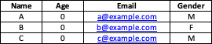

# XLSX Caesar Cipher Tool

[](https://www.python.org/)
[](http://www.wtfpl.net/about/)

## Overview

**XLSX Caesar Cipher Tool** is a simple Python project that demonstrates how to encrypt and decrypt Excel (XLSX) files using a Caesar cipher. The tool:
- **Encrypts** each cell in an XLSX file by shifting its alphabetic characters.
- **Decrypts** the encrypted XLSX file by reversing the shift.
- Generates a **sample Excel file** (`input.xlsx`) with dummy data using `pandas`.

> **Note:** The Caesar cipher is a basic encryption technique and is not secure for real-world use.

## Features

- **Encryption:** Shifts alphabetic characters in each cell using a Caesar cipher (default shift: 3).
- **Decryption:** Reverses the Caesar cipher to restore original text.
- **Sample Data Creation:** Automatically creates a sample Excel file with test data.

## File Structure
```plaintext
XLSX Caesar Cipher Tool/
├── README.md                    # Project overview and instructions
├── LICENSE                      # License information
└──  main
    ├── input.xlsx               # Sample Excel file created by the script
    ├── encrypted_input.xlsx     # Encrypted Excel file (generated from input.xlsx)
    ├── decrypted_output.xlsx    # Decrypted Excel file (generated from encrypted_input.xlsx)
    └── xslxStructEx.png         # Example excel file structure
```

## How it works
    
**Sample Data Generation:** The script first creates an Excel file (sample.xlsx) using sample data (Name, Age, Email, Gender).

**Encryption:** The encrypt_xlsx_file function reads input.xlsx, encrypts each cell in the data rows using the Caesar cipher (default shift of 3), and writes the encrypted data to encrypted_sample.xlsx.

**Decryption:** The decrypt_xlsx_file function reads encrypted_sample.xlsx, decrypts each cell by reversing the cipher (shift by -3), and saves the result as decrypted_sample.xlsx.

## Requirements

- Python 3.x

Install the required Python libraries using pip:

```bash
pip install openpyxl pandas
```

## How to Run

1. **Clone** this repository or **Download** all the files in the (`main`) folder.
2. **Generate sample data:**
    Run (`sampleExcel.py`) to create (`sample.xlsx`) file. (Modify table data as you wish)
3. **Encrypt the XLSX file:**
    Run (`dataEnc.py`) to encrypt (`sample.xlsx`). (This will create (`encrypted_sample.xlsx`))
4. **Decrypt the encrypted file:**
    Run (`dataDec.py`) to decrypt (`encrypted_sample.xlsx`). (This will create(`decrypted_sample.xlsx`))

**INCASE OF USING SAPARATE xlsx FILE:**
Make sure the xlsx file structure look like this:


## Limitations

- The Caesar cipher is a simple encryption method and should not be used to secure sensitive information.
- Only alphabetic characters are encrypted; numbers and special characters remain unchanged.

## Ethical Considerations & Responsible Use

- **Not for Security:** The Caesar cipher is not secure and can be easily broken. Do not use this tool to secure sensitive or personal data.
- **Potential Misuse:** Modifying it to handle more complex encryption schemes without proper security considerations could mislead users into thinking their data is secure.
- **Responsible Use:** One who use this program should understand the limitations of simple ciphers and avoid using them in real-world applications where security is important.

## License

- This project is licensed under the [](http://www.wtfpl.net/about/)
 license.


